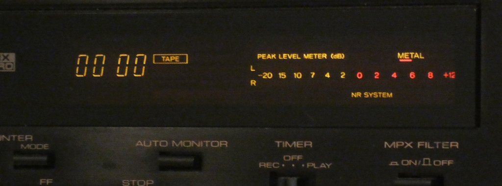
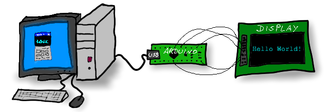

# VFD-Studio 2

Windows application to show various system information on a graphics-capable VFD or other monochrome graphics display.

If you would like to keep an eye on CPU load and memory usage during gaming, if you are a fan of (retro) case modding or if you just appreciate to have a little fancy additional display for your computer, then you've come to the right place.

<mark>Download here</mark>

<mark>Documentation here</mark>

<mark>Examples here</mark>

## What it is

Greetings everyone and welcome to VFD-Studio 2! This is a free and open-source project to show system information on a Vacuum Fluorescent Display ([VFD](https://en.wikipedia.org/wiki/Vacuum_fluorescent_display)) or other monochrome graphics display:

    <mark>TODO: YT-Video</mark>

A VFD is a kind of display you've probably seen before on HiFi devices or supermarket checkouts. Here's an example from a cassette player:

And although somewhat less common, VFDs are also available as graphic displays - which makes them nice gadgets for your PC to show pictures, animations or various system information using VFD-Studio.

### Features

- Displays images, animations, charts, etc.

- Displays various system information

- Highly configurable - includes an Editor application for creating your own screen designs

- Intuitive user interface, including a preview-display and useful controls

### Supported displays

- Noritake Itron GU-800 VFD Series (tested with a GU128x64-800B)

- Noritake Itron GU-300 VFD Series (tested with a GU256x64-372, identical to GU256X64F-9900)

- Basically any display supported by the Arduino [U8glib](https://github.com/olikraus/u8g2/) library (tested with a DIY More 128x64 OLED, SSD1309 chip)

## How it works

The general concept is that the display is connected to an [Arduino](https://en.wikipedia.org/wiki/Arduino)-microcontroller (source and schematics are included in this project) which communicates via USB serial connection with a computer that runs VFD-Studio. Let me show this in a premium-quality illustration:

Once all installed and wired, simply start VFD-Studio, configure the type of display, it's resolution and select the serial port.

VFD-Studio processes so-called *Lists*, which contain instructions for the display - e.g. draw an image or print some text.

A set of instructions belongs to a *Screen* which is displayed for a certain duration before the next Screen is displayed.

VFD-Studio let's you load Lists, skip to the next Screen or stay at the current one and even provides a dedicated Editor application with a overview on all available display commands and system information for designing your own Lists and Screens .
