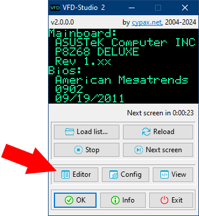
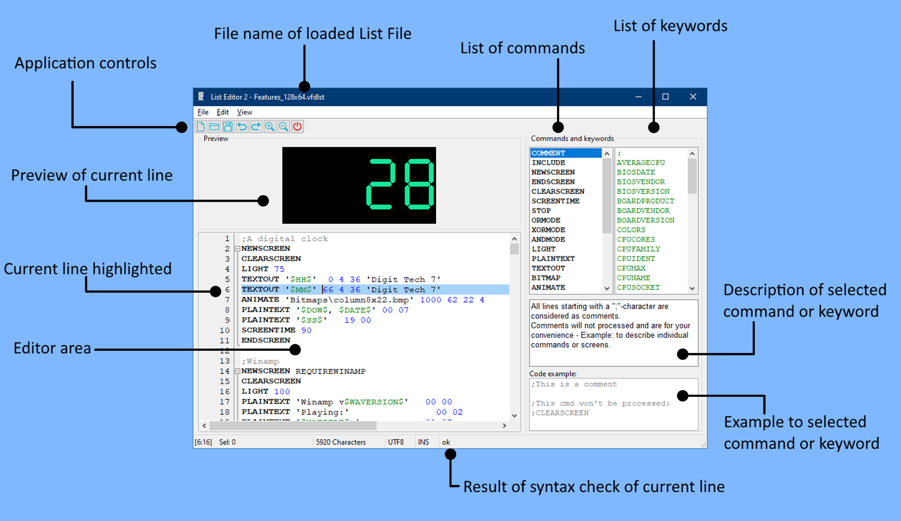
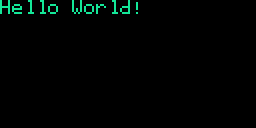
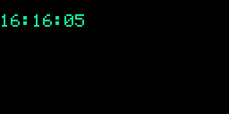
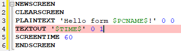
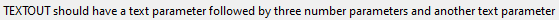
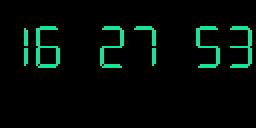

# List Editor usage

The VFD-Studio 2 application reads and processes text based files (*List Files*) which contain *commands* for the display to print text, show images, etc.

And it comes with an dedicated *List Editor* application that allows you to easily create and edit your own List Files.

## List Editor application

The editor application resides in the same directory as the VFD-Studio 2 application. You can find it in the start menu section of VFD-Studio 2 or you can open it directly from VFD-Studio 2:



## List Editor window



> [!TIP]
> You can move and resize the List Editor window as you like. It will remember position and size when opened again.

### Editor area

Like any text editor the List Editor window contains an editor area where you can type text. Text will be displayed with syntax highlighting and coloring.

### Command and keyword lists

On the right side of the window you'll find two lists with all known display commands and keywords.

While display commands are instructions for the display, keywords represent system information to be displayed in textual form. By clicking on a command or keyword in the list, a description and example is shown below.

You can also get description and example by placing the caret on a command or keyword in the editor area and pressing F1.

### Preview Display

The Preview Display virtually imitates how the current line would be displayed on the real display. Which can be quite helpful when aligning text or graphics.

The preview display adapts in size and color to the [display settings](./2_Setup.md#display-settings) from the VFD-Studio 2 application settings window.

> [!NOTE]  
> 
> The preview works best for static content. Some commands and keywords might not be available for preview or only to limited extend - e.g. animations won't be played but only the first frame will be displayed.

### Status bar

On the bottom of the window, there is a status bar which shows (from left to right):

* caret position

* number of selected characters

* number of total characters

* file encoding (should always be UTF8 Unicode)

* text insert / overwrite mode

* the result of a syntax check of the current line

## Editing List Files

In this section we will learn about the List Editor functions by creating an example list.

Start with a new file. Press F2 or select Menu > File > New to create a new file.

### Screens

Content to be shown on the display is grouped by so called *Screens*. A Screen begins with a `NEWSCREEN` command and ends with a `ENDSCREEN` command.

Previous content on the display would not be erased by default when a Screen begins. Thus, within these two commands, insert a `CLEARSCREEN` command.

Also we want to show this Screen for 60 seconds, so insert a `SCREENTIME 60` command right before the `ENDSCREEN` command. 

This is how it should look now:

```
NEWSCREEN
CLEARSCREEN
SCREENTIME 60
ENDSCREEN
```

> [!TIP]  
> 
> You can also insert a Screen structure by simply pressing Alt+N or via Menu > Edit > Insert NEWSCREEN.

### Displaying simple text

Now let's display some text.  Insert a command `PLAINTEXT 'Hello World!' 0 0` after the `CLEARSCREEN`command: 

```
NEWSCREEN
CLEARSCREEN
PLAINTEXT 'Hello World!' 0 0
SCREENTIME 60
ENDSCREEN
```

The Preview Display will let you know how it will look on the display:



### Keywords

Since a "Hello World" is still boring, why not change it to a Hello from your computer?
Change the `PLAINTEXT` command line to this: `PLAINTEXT 'Hello form $PCNAME$!' 0 0` 
As you can see in the Preview Display, the `$PCNAME$` keyword will be replaced with the network name of your computer.

VFD-Studio 2 can show static information like the computer name on the display and dynamic information. Unlike static information, dynamic information can change at any time and thus will be re-written on the display periodically.

Let's try that by displaying the time:

```
NEWSCREEN
CLEARSCREEN
PLAINTEXT 'Hello form $PCNAME$!' 0 0
PLAINTEXT '$TIME$' 0 1
SCREENTIME 60
ENDSCREEN
```

Note that the Preview Display of the List Editor will not update the preview periodically but still you can see how the time information would look on the display:



### Text with font

The clock we created is nice, but to a bit to small. Let's change the font and make it bigger.
Change the `PLAINTEXT` commend for the `$TIME$` keyword to a `TEXTOUT`command:

```
NEWSCREEN
CLEARSCREEN
PLAINTEXT 'Hello form $PCNAME$!' 0 0
TEXTOUT '$TIME$' 0 1
SCREENTIME 60
ENDSCREEN
```

You will notice, that the line in now highlighted in red, which indicates a syntax error:



If you look to the status bar, the List Editor will tell you what appears to be wrong:
   
Move the caret to the `TEXTOUT`command and press F1 or click on the `TEXTOUT` command on the command list on the right side of the List Editor window to get its description and an example.

While `PLAINTEXT` is used to display unformatted text in a default 8x6 pixel font on a specific column and row, the `TEXTOUT`command can display text with a specific font and size.
So let's fix that error and change the line to `TEXTOUT '$TIME$' 0 10 18 'Digit Tech 7'`
This is how it should look now:



If it doesn't look like the above, then that's because you need the *Digit Tech 7* font installed to your Windows system which can be downloaded [here](https://fontesk.com/digit-tech-typeface/).

### Graphics

Now let's add some real graphics. Move the caret behind the `ENDSCREEN`command and press enter. You are now in the last line of the List File. Press Alt+N to insert another Screen.
This is how it should look like:

```
NEWSCREEN
CLEARSCREEN
PLAINTEXT 'Hello form $PCNAME$!' 0 0
TEXTOUT '$TIME$' 0 10 18 'Digit Tech 7'
SCREENTIME 60
ENDSCREEN
;add a description here
NEWSCREEN
CLEARSCREEN

SCREENTIME 60
ENDSCREEN
```

Move the caret to the blank line after the `CLEARSCREEN`command and press Alt+B or select Menu > Edit > Insert BITMAP.

A file open dialog window will open and let you chose a graphics file from the file system.

> [!NOTE]
> Currently, VFD-Studio 2 supports only the bitmap graphics format (\*.bmp) and the images should be in 1-bit black & white.

Chose a bitmap file to be displayed. In the VFD-Studio 2 installation directory you can find some example images.

A line like the following will be inserted in the List File: `BITMAP 'Bitmaps\128x64\earth128x64.bmp' 00 00`

And on the Preview Display you can see, how it will look like:


### Animations

Delete the `BITMAP` line and press Alt+A or select Menu > Edit > Insert Animation.

Again a file open dialog window will open and let you chose a graphics file from the file system.

Animations are also stored in bitmap files with all frames placed side by side in one horizontal line:


Chose an animation bitmap file to be displayed. In the VFD-Studio 2 installation directory you can find some example images.

A line like the following will be inserted in the List File: `ANIMATE 'Bitmaps\animations\robot46x48_10.bmp' 1000 00 00 46`

And on the Preview Display you can see, how it will look like:


> [!NOTE]  
> In the Preview Display of the List Editor only the first frame will be shown.

> [!TIP]  
> The animation files in the VFD-Studio 2 installation directory follow a naming scheme `<name><frame width>x<frame height>_<number of frames>`. Although this is not mandatory, it provides for some organization in the Windows Explorer and helps the List Editor to automatically determine the frame width which is the last parameter of the `ANIMATE` command.

### How to go on

You now know the most important commands. Now experiment further on your own. Let the List Editor show you command and keyword descriptions and learn from the examples shown.

> [!TIP]  
> When you open the List Editor from the VFD-Studio 2 application, the currently displayed List File will be loaded in the List Editor. Make some changes there, save it, switch back to the VFD-Studio 2 application and press the Reload button to apply the changes directly on the display which is connected to your computer.
