* [Noritake Itron VFDs](#noritake-itron-vfds)
  * [What you'll need](#what-youll-need)
  * [Instructions](#instructions)
    * [Adapter board](#adapter-board)
      * [Soldering the connectors](#soldering-the-connectors)
      * [Wiring](#wiring)
      * [Checking](#checking)
    * [Assembly](#assembly)
    * [Firmware installation](#firmware-installation)
    * [Launch](#launch)
  * [Troubleshooting](#troubleshooting)

___

# Noritake Itron VFDs

First of all, for those who wonder:
A [*VFD*](https://en.wikipedia.org/wiki/Vacuum_fluorescent_display) is a kind of display you've probably seen before on HiFi devices or supermarket checkouts. Here's an example from a cassette player:

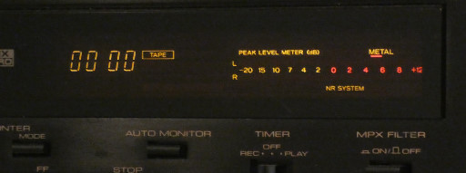

Most of these displays can only show certain symbols or digits. However, there are also graphics-capable VFDs. Much less common and much more expensive, but they make very fascinating gadgets for your PC to show pictures, animations or various system information using VFD-Studio 2:

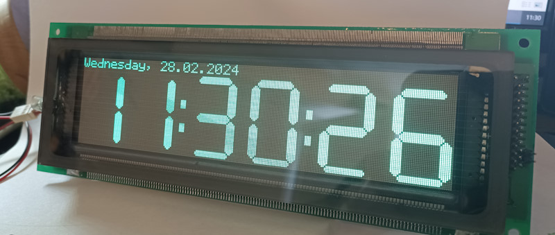

## What you'll need

**Materials:**

* A Noritake Itron 800 or 300 series VFD
  * Unfortunately those VFDs are as pricey as rare. The best approach is to look on eBay for cheap used ones.
  * VFD-Studio 2 is tested with a GU128x64-800B display (800A should do too) and a GU256x64-372 display, which has the same datasheet as the GU256X64F-9900.
* An [Arduino Nano board](https://docs.arduino.cc/hardware/nano/), incl. USB cable
* A 5V power supply for the display
  * A VFD requires a lot of power. A 256X64 display may take more than 2A, which is far more than a typical USB port could deliver.
* A 2x13 pin female connector, 2.54mm pitch, 90° angulated
* Two 1x15 male connectors, 2.54mm pitch
* Two 1x15 female connectors, 2.54mm pitch \[optional, if you want the Arduino Nano to be removable\]
* A prototype PCB
* Some wire and solder

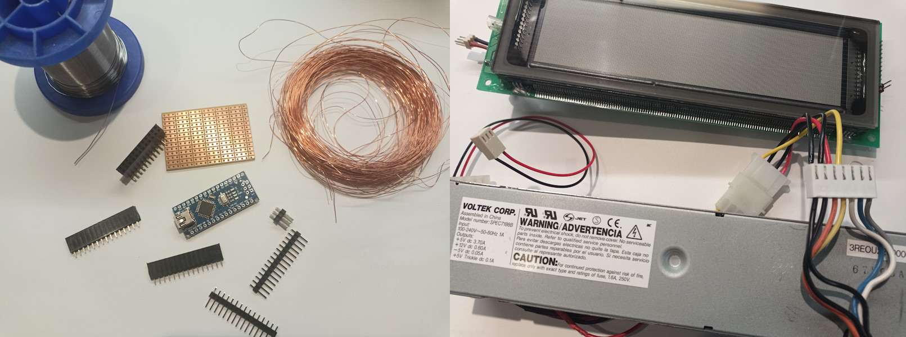

> [!CAUTION]
> Be super careful when handling the VFD! Do not damage the fragile glass evacuation tube on the side or you risk expensive hardware ending up as useless trash just because of a small mishap.
> 
> 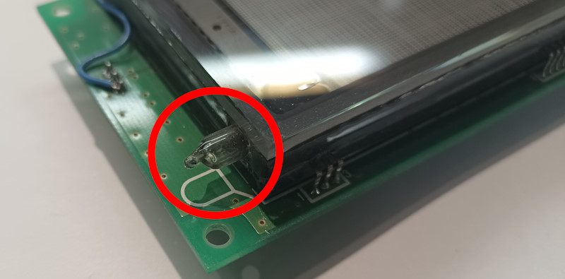

**Tools:**

* A soldering iron with a fine tip

* A continuity tester

* The Arduino IDE
  
  * Download from [arduino.cc](https://www.arduino.cc/en/software)
  
  * I have to admit that personally I still mess around with version 1.8 of the Arduino IDE. But there should be no reason why it wouldn't work with newer versions too.

**Skills:**

* Reading/understanding schematics
* Some soldering work (no SMD parts though)
* Actually no programming skills. But you'll have to compile and upload a program to the Arduino Nano. So it would be quite beneficial if this was not your very first project with an Arduino.

## Instructions

### Adapter board

The VF-display cannot just be plugged into a computer so we need to build an adapter board with the Arduino.

#### Soldering the connectors

1. Start by soldering the 1x15 male connectors to the bottom side of the Arduino Nano. The PCB might be a good help to keep the connectors aligned. Do not solder the connectors to the PCB though. 
   
   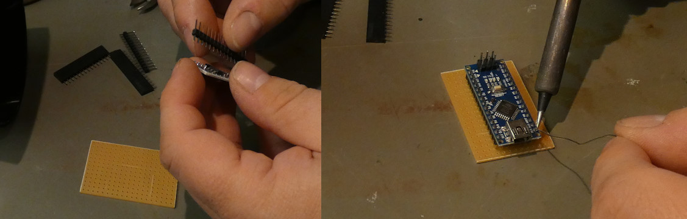

2. Solder the 90° 2x13 female connector to the PCB.

3. Solder the two 1x15 female connectors to the PCB. The Arduino might be a good help to keep the connectors aligned:
   
   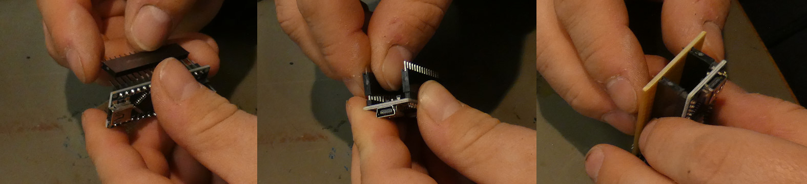

4. This is how it should look now:
   
   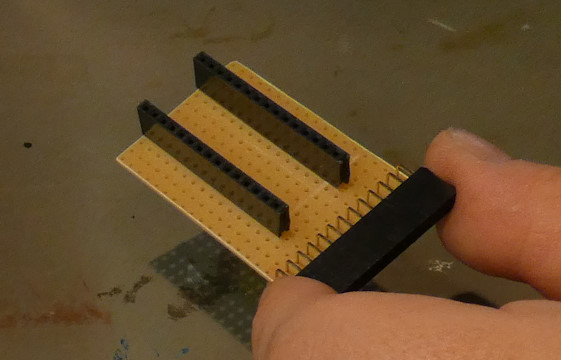

#### Wiring

Now to the "fun" part.

Turn the adapter board <u>bottom side up</u>. What we want to achieve is something like this:

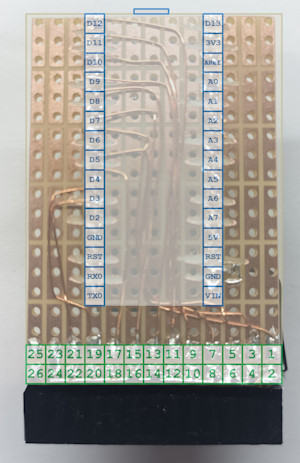

> [!NOTE] 
> I used a prototype PCB here with 1x3 pads which I had to manually cut to get 1x1 ones. There are prototype PCB with 1x1 pads - try to get one of those.

In words, the schematics are like following:

| Display pin (function) | Arduino Nano pin (function) |
| ---------------------- | --------------------------- |
| 1  (Data7)             | D7  (PD7)                   |
| 3  (Data6)             | D6  (PD6)                   |
| 5  (Data5)             | D5  (PD5)                   |
| 7  (Data4)             | D12 (PB4)                   |
| 9  (Data3)             | D11 (PB3)                   |
| 11 (Data2)             | D10 (PB2)                   |
| 13 (Data1)             | D9  (PB1)                   |
| 15 (Data0)             | D8  (PB0)                   |
| 17 (/WR)               | D4  (PD4)                   |
| 19 (C/D)               | D3  (PD3)                   |
| 21 (/RD)               | D2  (PD2)                   |
| 23 (/CS)               | GND                         |
| 2..24                  | GND                         |

Let's go:

1. Start by connecting the display pins 2..24 to ground (GND) of the Arduino.

2. Connect the data pins of the display 1..15 with the Arduino.

3. Connect the control pins 17 (*/WR*), 19 (*C/D*) and 21 (*/RD*) with the Arduino.

4. Connect the display pin 23 (*/CS*) with ground (a drop of solder connects it to the opposite pin 24).

Follow the instructions in the image. **Remember: The image shows the adapter board from the bottom side.** Click the image to enlarge it:

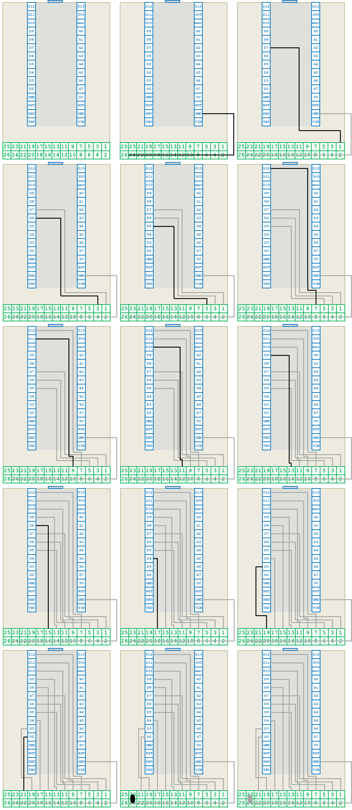

#### Checking

1. With the Arduino still unplugged, take a continuity tester and check that all wires are connected properly and do not conduct with neighbor pins.

### Assembly

1. Plug the Arduino Nano into the adapter board.
   
   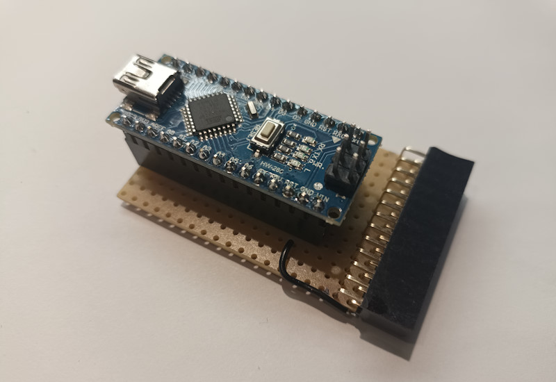

2. Plug the adapter board into the display. Make sure it is plugged in the right way up.
   
   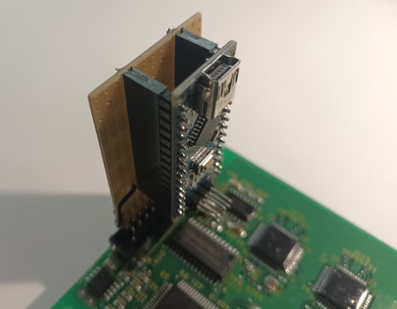

3. Connect the display to the separate power supply.

4. Connect the Arduino on the adapter board to a USB port of the computer.

5. 🎉🎆 Congratulations - you are done with hardware! 🎆🎉

### Firmware installation

1. Start the Arduino IDE.

2. Open the [ArduinoNTKDriver.ino](../source/ArduinoNTKDriver/ArduinoNTKDriver.ino) file in the Arduino IDE.

3. Select Menu > Tools > Boards > Arduino AVR Boards > Arduino Nano

4. Select Menu > Tools > Processor > ATmega328 (Old Bootloader)

5. Select Menu > Tools > Port > the port your Arduino Nano connects to

6. Press Ctrl+R to compile.

7. Press Ctrl+U to upload to the Arduino Nano.

### Launch

1. Start VFD-Studio.

2. Got to the [settings window](./Setup.md) and select:
   
   * *Noritake GU-300 Series* or *Noritake GU-800 Series* (depending on your display)
   * The port, which you selected in the Arduino IDE
   * Baud rate 115200

3. After a restart of VFD-Studio 2 you should be able to see something on the display.

## Troubleshooting

**The Arduino doesn't connect with the computer.**

* Open the Windows device manager and open the *Ports (COM & LPT)* section. Unplug and plug in the USB cable. Observe if a new interface shows up.
  
  If the interface shows up with an error indicator, you might have to change the driver.

**The Arduino IDE doesn't upload the firmware.**

* Make sure you have selected the correct port:
  
  Select Menu > Tools > Port > the port your Arduino Nano connects to

* Maybe try another bootloader:
  
  Select Menu > Tools > Processor > ATmega328 or ATmega328 (Old Bootloader)

**The display doesn't show anything.**

* Make sure the display is powered. You cannot use the 5V from the Arduino's USB supply but you'll need a separate and strong power supply for the VFD.

* Have you [checked](#checking) the wiring of the adapter board and the [assembly](#assembly)?

* Make sure the correct display type and interface is selected in VFD-Studio.

* In some cases the display controller might be stuck. This helps:
  
  1. Unplug the USB cable
  2. Unplug the display power supply
  3. Unplug the adapter board from the display
  4. Plug in the display power supply
  5. Plug in the adapter board to the display
  6. Plug in the USB cable
  7. Try again using it with VFD-Studio 2

* Make sure the problem is not located within the Arduino:
  
  1. Unplug the adapter board from the display
  2. Open the Arduino IDE
  3. Compile and upload the *Blink* example. If this works, the Arduino is not the problem.
  4. Upload the [ArduinoNTKDriver.ino](../source/ArduinoNTKDriver/ArduinoNTKDriver.ino) file again

* Check if we can communicate with the ArduinoNTKDriver.ino firmware on the Arduino:
  
  1. Close VFD-Studio 2
  2. Open the Arduino IDE
  3. Select Menu > Tools > Serial Monitor
  4. Configure baud rate 115200
  5. Send "i" (without quotation marks)
  6. The Arduino should respond with something like "Arduino driver for Noritake GU 300/800 VFD series v1.0.0.0"

If none of that helps, ask the following questions:

* Did this display work before? What has changed since?
* Did this Arduino Nano work before? Did it work while plugged into the adapter board too? What did change since?
* Are we 100% sure the wiring and assembly is correct