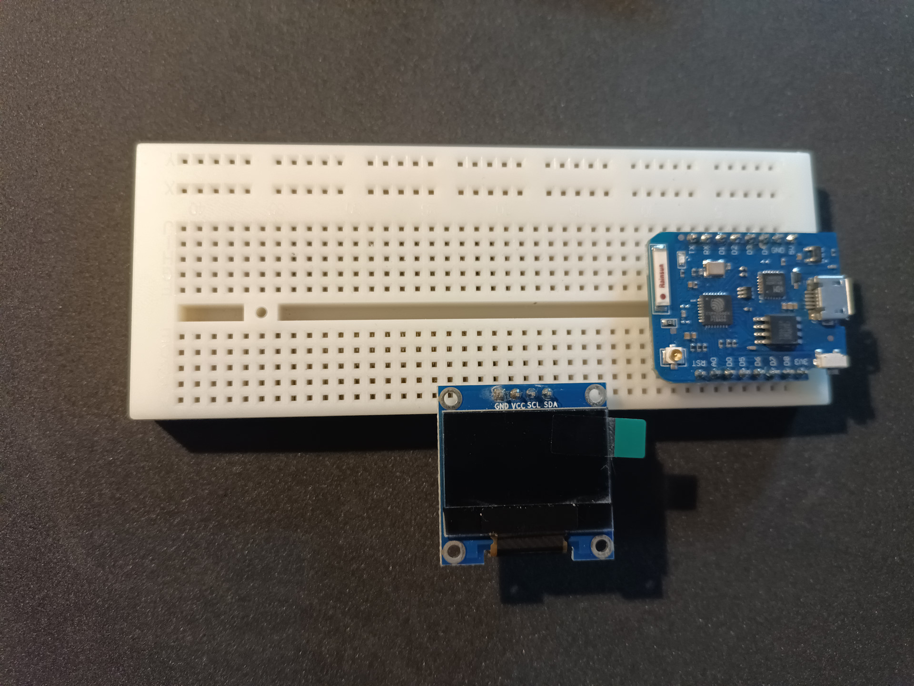
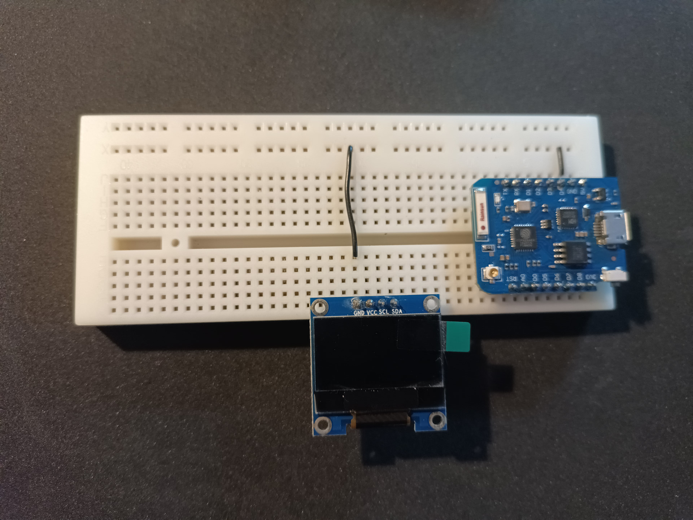
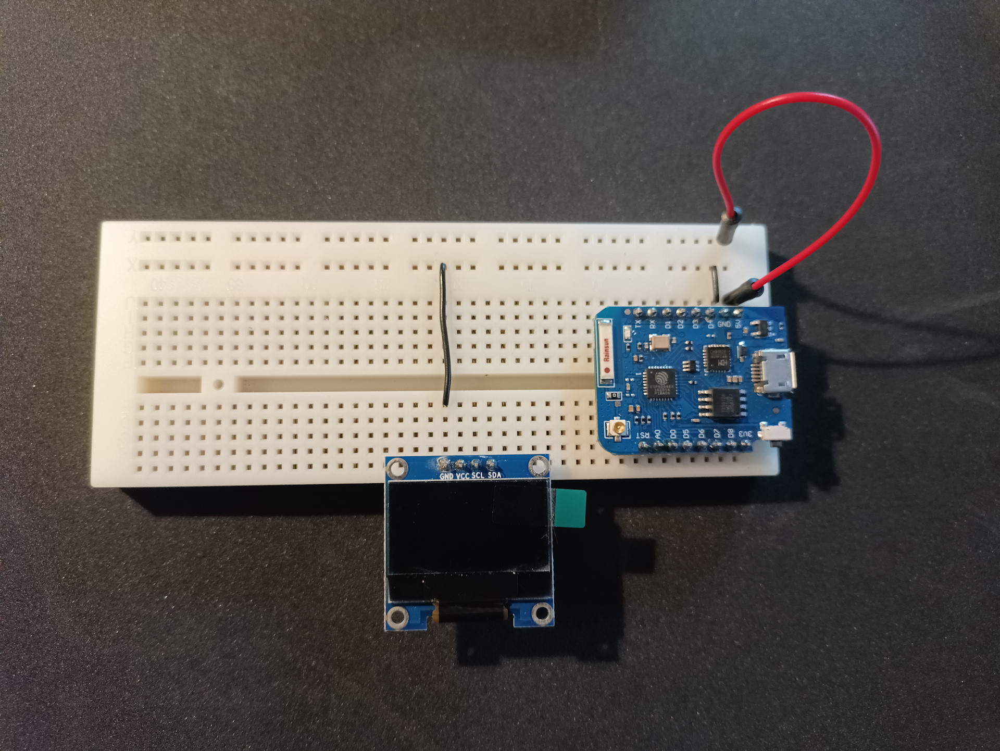
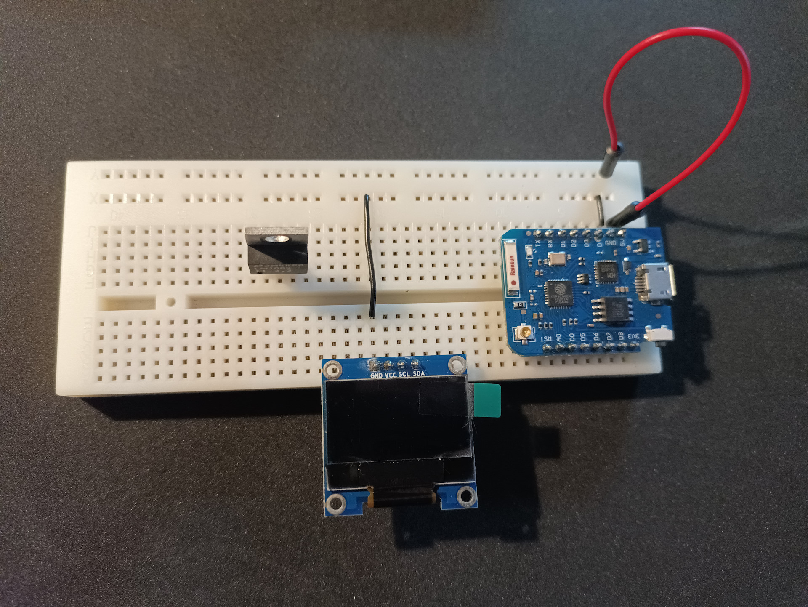
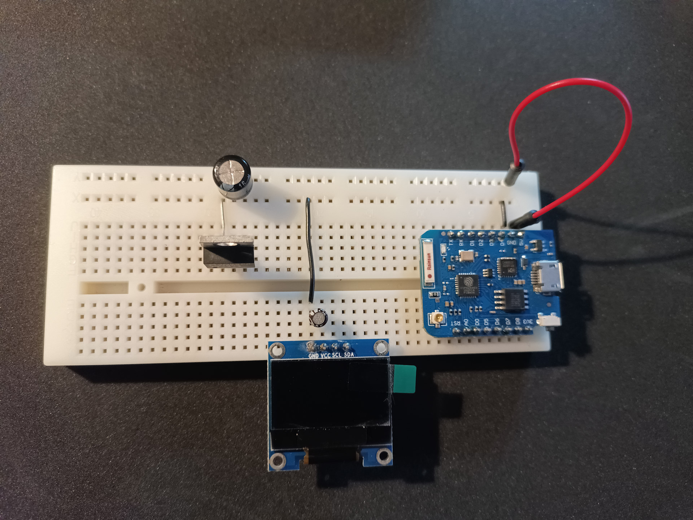
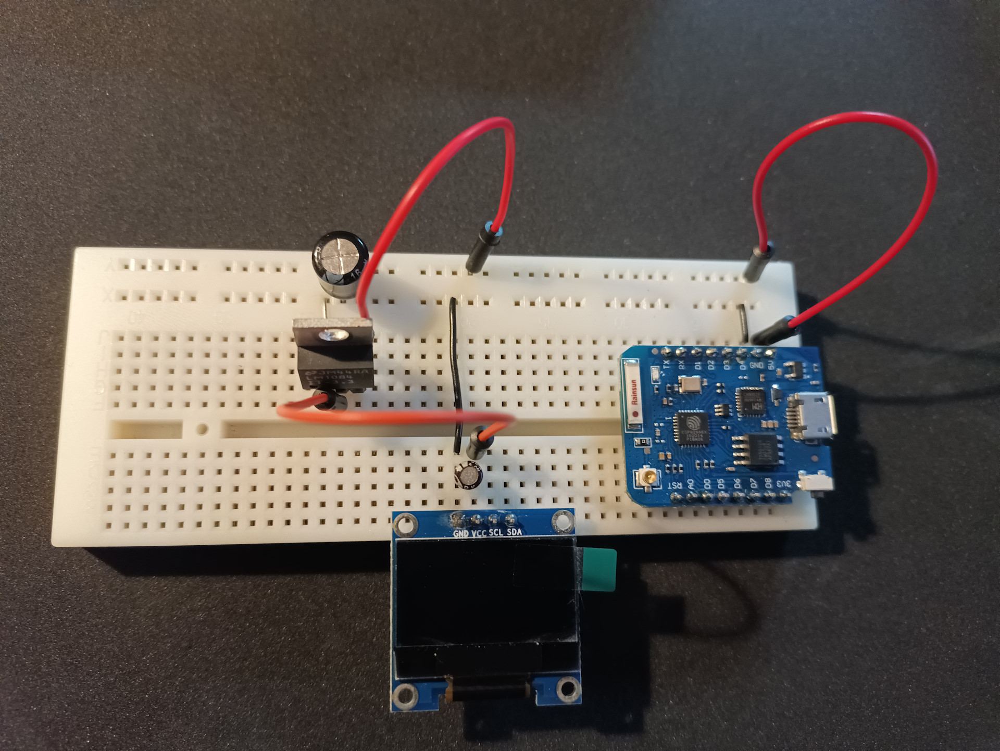
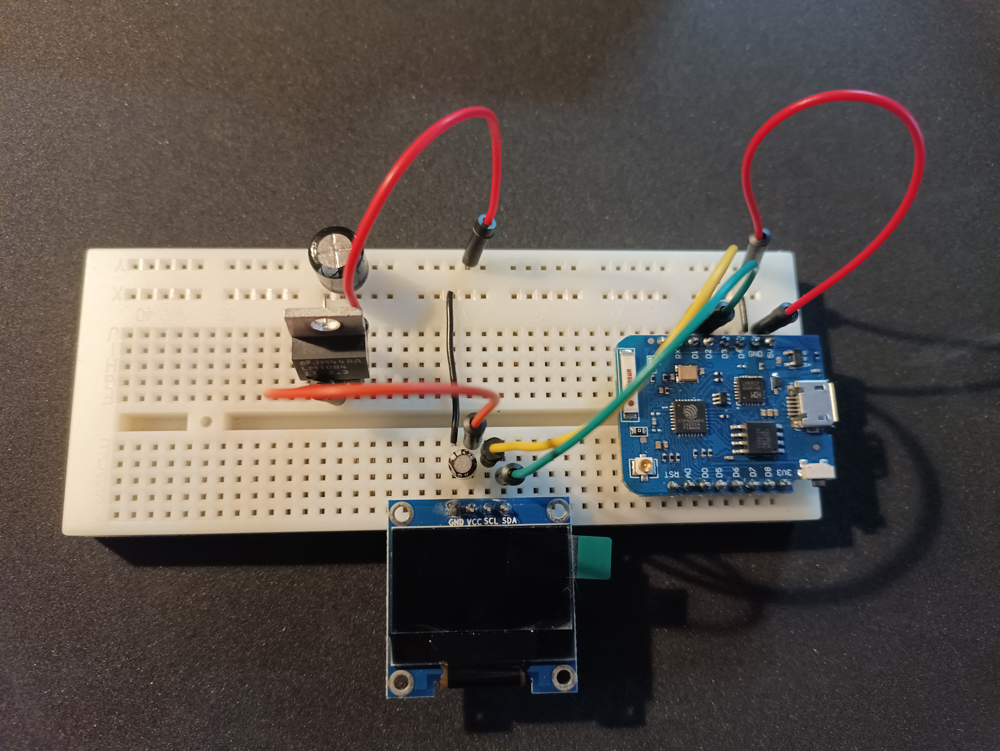
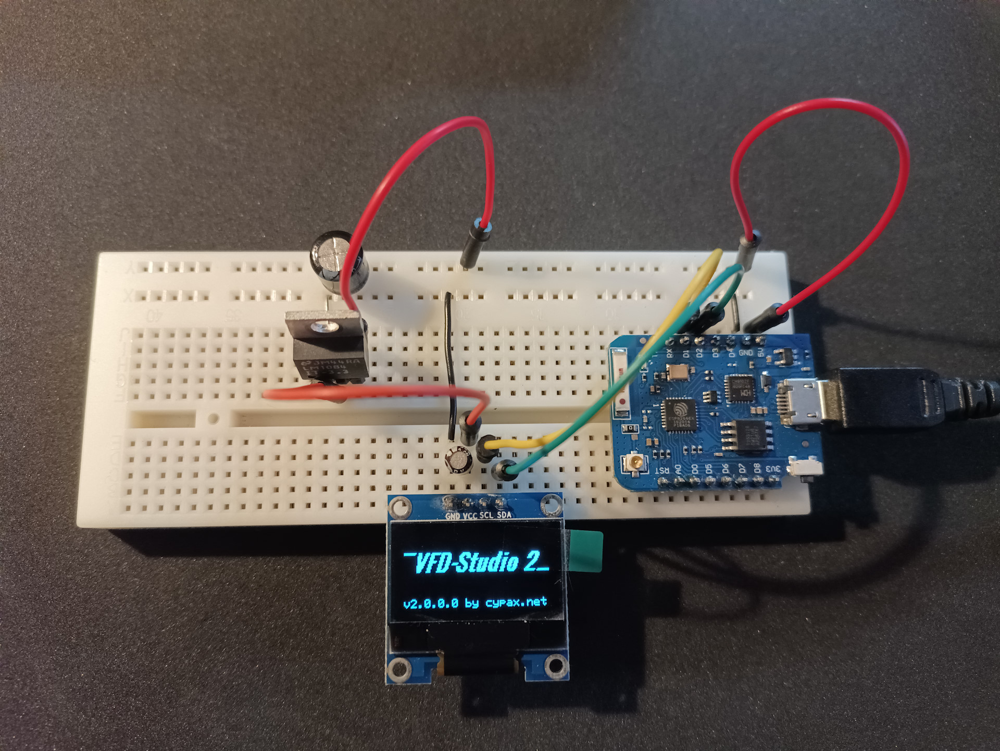

# U8g2 compatible displays

A ton of LCD and OLED displays can be used with VFD-Studio 2. Basically any display supported by the [U8glib library](https://github.com/olikraus/u8g2) is suitable. 

However, displays are available with different connection types, which is also the reason why they cannot simply be connected to the PC, but require an adapter with an Arduino board.

## Arduino board selection

The recommended approach is to select the controller based on the chosen display. 
The following criteria are relevant doing this:

* The display interface type. - Select an Arduino board that provides the display connection type (e.g. I2C or SPI) or the number of available GPIOs.
  As said, displays come with a variety of connection types like I2C, SPI. Others may require eight or more input signals in addition to control signals and thus a lot of available pins. It should also be noted that not every pin on an Arduino board is equally suitable, as some of them have dual functions or need to be on a specific voltage level during the boot process.
* The display voltage. - Select an Arduino board that matches the display voltage level (e.g. 3.3V or 5V).
  Typical display voltages are 3.3V and 5V. It is possible to work with level shifters, but the less complicated way is to chose an Arduino Board which already provides the respective voltage levels.
  Also consider the power consumption of the display. Many Arduino boards cannot provide much current, especially on the 3.3V line.

> [!CAUTION]
> Incorrect voltage levels might destroy the display!

## What you'll need

**Materials:**

* An Arduino-compatible Arduino board, incl. USB cable.
* A display which is supported by the [U8glib library](https://github.com/olikraus/u8g2/wiki/u8g2setupcpp) and depending on the chosen display:
  * a dedicated power source for the display
  * Cables, connectors, additional electronic components
* A prototype PCB
* Some wire and solder

**Tools:**

* A soldering iron with a fine tip
* Small pincers
* A voltage meter
* The Arduino IDE 
  * Download from [arduino.cc](https://www.arduino.cc/en/software)
  * I have to admit that personally I still mess around with version 1.8 of the Arduino IDE. But there should be no reason why it wouldn't work with newer versions too.

**Skills:**

* Reading/understanding simple schematics
* Some soldering work (no SMD parts though)
* Actually no programming skills. But you'll have to compile and upload a program to the Arduino board. So it would be quite beneficial if this was not your very first project with an Arduino.

> [!NOTE]
> If you don't like soldering and stability is of less importance, you can use a [breadboard](https://en.wikipedia.org/wiki/Breadboard) instead.

## Instructions

### Adapter board

A LCD or OLED display cannot just be plugged into a computer so we need to build an adapter with an Arduino board.

In this instructions I will use a 128x64 OLED display with I2C interface as it can be found often on eBay for little money this days. It is tiny, but it does the job.

> [!TIP]
> I2C is a rather slow serial interface. When it comes to high display resolutions (128x64 counts as high in this context) and displaying animations or effects you better go with a SPI interface.

This display runs on 3.3V while most regular Arduino boards work with 5V. That's why I use an ESP8266 Wemos D1 board which runs on 3.3V too and for which Arduino drivers also exist.

And to make it a little more easy for me to illustrate and more easy for you to recreate, the entire build is based on a breadboard.

#### Build

1. Start by placing the ESP board and the display on the breadboard. Do not yet connect the board to USB.
   
   

2. Connect the ground lines (_GND_).
   
   

3. The Wemos D1 board can provide only very little power on the 3V3 pin, so we will need to power the display from 5V from USB. Since the display however runs at 5V we will use a dedicated voltage regulator.
   In this step we route the 5V from the _5V_ pin, which is powered by USB, to a power line of the breadboard.
   
   

4. Next, we place a 3.3V voltage regulator. The one shown here is a [LM1084](https://www.ti.com/lit/ds/symlink/lm1084.pdf). Seen from the front, the left pin is ground, the middle one is 3.3V out and the right pin is input voltage.
   Other voltage regulators may have different pinout!
   
   

5. Connect the left pin of the LM1084 to the ground line of the breadboard. I also added a 220?F electrolytic capacitor close to the voltage regulator between the ground and the 5V line and a 10?F electrolytic capacitor close to the display between the GND and VCC pins. Those are to eliminate voltage fluctuations. The exact capacity doesn't matter much - you could use anything from 47?F to 470?F and 1?F to 47?F as well. What matters is that you do not confuse the poles of the capacitors; usually the negative side (ground) is marked with a thick line on the casing. 
   
   

6. Now connect the right pin of the LM1084 to the 5V line of the breadboard and the middle pin to the VCC pin of the display.
   Remember: different voltage regulators may have a different pinout.
   
   

7. Although being slow, the benefit of I2C is that you basically need just two signals: in this step we connect SCL (serial clock signal) and SDA (serial data line) from the display to the ESP8266 board.
   I googled the [board pinout](https://edistechlab.com/esp8266-wemos-d1-mini-pin-out/) and SCL (yellow cable) goes to pin D1 and SDA (green cable) goes to D2.
   
   

8. It is a good idea to check everything now before going on. You also might want to unplug the display, connect the USB cable to the ESP8266 board and a computer and check with a voltage meter if there is 3.3V coming out from the voltage regulator. If everything is ok, unplug USB, reconnect the display to the breadboard and plug in USB again.
   The picture below shows the display already running with VFD-Studio 2. To achieve this, the Arduino firmware must be adapted and uploaded which is described in the next section.
   
   

### IDE setup

1. Start the Arduino IDE.

2. Select Menu > File > Preferences to open the preferences window.

3. Add `http://arduino.esp8266.com/stable/package_esp8266com_index.json` to the *Additional Board Manager URLs* field (multiple URLs can be added by separating them with commas).

4. Select Menu > Tools > Boards and find the *esp8266* platform.

5. Select version 2.7.4 and click install.

> [!NOTE]
> This are example instructions for an ESP8266 board. Depending on your selected display other Arduino compatible boards might be suitable which would require a different setup.
> Native Arduino boards (e.g. Arduino Uno, Arduino Nano, etc.) do not require this procedure at all and are supported by the Arduino IDE by default.

### Firmware installation

1. Restart the Arduino IDE.

2. Open the [ArduinoSSD1309Driver.ino](../source/ArduinoSSD1309Driver/ArduinoSSD1309Driver.ino) file in the Arduino IDE.

3. Select Menu > Tools > Boards > ESP8266 Boards (2.7.4) > Lolin (Wemos) D1 mini Pro

4. Select Menu > Tools > Port > the port your ESP8266 connects to.

5. Locate the `u8g2` constructor which is somewhere around line 121. Change it to
   
   ```cpp
   // A display constructor using hardware I2C:
   U8G2_SSD1306_128X64_VCOMH0_F_HW_I2C u8g2(U8G2_R0);
   ```

6. Press Ctrl+R to compile.

7. Press Ctrl+U to upload to the ESP8266.

> [!NOTE]
> This are example instructions for an ESP8266 board and a specific SSD1306 display controller. Depending on your selected display and Arduino board other steps will be required.

#### Explanation

In step #3 we tell the Arduino IDE which Arduino compatible board we are using. Make sure this selection matches your specific board.

In step #4 we tell the Arduino IDE to which port the board is connected to. See the [troubleshooting section below](#troubleshooting), if you are unsure which port it is.

In step #5 we tell what kind of display it is and how it is connected to the board. This is how I proceeded:

1. Know what resolution the display has (e.g. 128X64).

2. Know what controller your display has. For example: on the backside of the display I used here it says *SSD1306*.

3. Know what interface you are using. As mentioned above, the display I used has a I2C interface. 
   Note: Sometimes, displays also might provide more than one interface.

4. Search the [u8g2 constructor reference](https://github.com/olikraus/u8g2/wiki/u8g2setupcpp#constructor-reference) for a constructor that matches your display. The naming scheme is: `U8G2_<controller>_<resolution>_<manufacturer>_<variant>_<interface>`
   Displays acquired via eBay or AliExpress are often cheap but also often badly documented. I my case didn't know who the manufacturer is, so I started with `U8G2_SSD1306_128x64_NONAME_1_HW_I2C` where *HW_I2C* stands for hardware I2C interface (it is also possible to emulate interfaces such as I2C or SPI with software).

5. Try it. Upload the firmware to the board as described in steps #6 and #7 and observe what the display shows. If it's working correctly the display should show a random pixel pattern when you press the reset button on the board.
   If it does not, only partly or if you experience irregularities when running the display from VFD-Studio 2, you need to go back to step #5 and try another constructor. I ended up with `U8G2_SSD1306_128X64_VCOMH0_F_HW_I2C` being the one that works best with my specific display.

### Launch

1. Start VFD-Studio.

2. Got to the [settings window](./Setup.md) and select:
   
   * *u8g2_compatible*
   * The port, which you selected in the Arduino IDE
   * Baud rate 115200
   * The display resolution

3. After a restart of VFD-Studio 2 you should be able to see something on the display.

## Troubleshooting

**The Arduino board doesn't connect with the computer.**

* Open the Windows device manager and open the *Ports (COM & LPT)* section. Unplug and plug in the USB cable. Observe if a new interface shows up.
  
  If the interface shows up with an error indicator, you might have to change the driver.

**The Arduino IDE doesn't upload the firmware.**

* Make sure you have selected the correct port:
  
  Select Menu > Tools > Port > the port your Arduino compatible board connects to

**The display doesn't show anything.**

* Push the reset button on the Arduino compatible board. If the display shows a random pixel pattern, the problem resides within the connection to the PC or within VFD-Studio 2 but not within the display/Arduino combination.

* Make sure the display is powered. Measure the supply voltages using a voltage meter.

* Have you checked the wiring?

* Make sure you have selected the correct constructor matching the respective display controller, resolution, interface and variant. Maybe try an alternative constructor variant.

* Make sure the correct display type and interface is selected in VFD-Studio 2.

* Make sure that the Arduino microcontroller is working correctly:
  
  1. Unplug the adapter board from the display.
  2. Open the Arduino IDE.
  3. Compile and upload the *Blink* example. If this works, the Arduino is not the problem.
  4. Upload your modified [ArduinoSSD1309Driver.ino](../source/ArduinoSSD1309Driver/ArduinoSSD1309Driver.ino) file again.

* Check if we can communicate with the firmware on the Arduino:
  
  1. Close VFD-Studio 2
  2. Open the Arduino IDE
  3. Select Menu > Tools > Serial Monitor
  4. Configure baud rate 115200
  5. Send "i" (without quotation marks)
  6. The Arduino should respond with something like "Arduino driver for U8g2 compatible displays v1.0.0.0"

If none of that helps, ask the following questions:

* Did this display work before? What has changed since?
* Did this Arduino board work before? Did it work while connected to the display too? What did change since?
* Are we 100% sure the wiring is correct