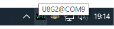
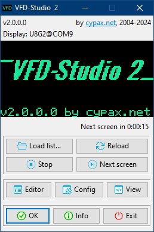
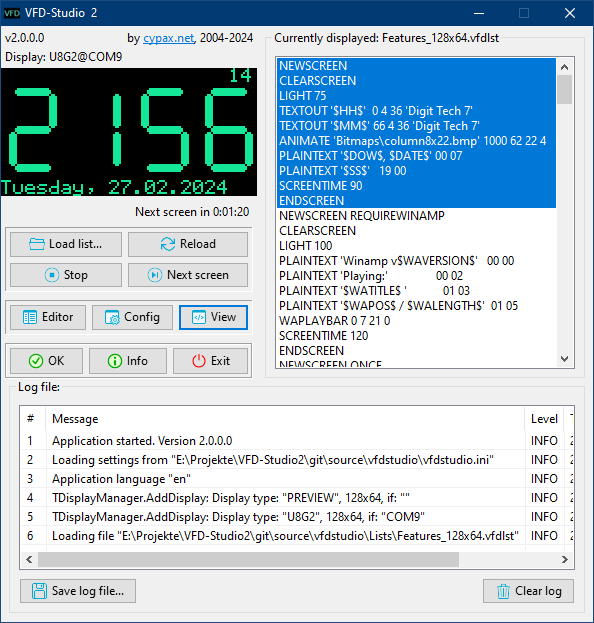

# Usage

## General concept

VFD-Studio 2 is a Windows application intended to show various text, graphics and system information on a monochrome graphics display.

Since these displays usually do not have any interface suitable to be connected directly to a computer, an <mark>Arduino microcontroller</mark> will serve as the driver and connect to the computer via USB serial interface.

The VFD-Studio 2 application reads and processes text based files (*List Files*) which contain *commands* - e.g. print some text, show an image, etc.

It is neither possible nor desirable to show all information on a small display at the same time. That's why list files are structured by *Screens* which are shown in sequential order. When the last screen was shown, the list begins anew.

## Taskbar icon

VFD-Studio 2 will be shown as an icon in the Windows task bar. Hovering the mouse cursor above the item will display the selected display type and interface: 

By clicking on the icon, a menu will open from where the *main window* of VFD-Studio 2 can be opened.

The other menu options are used to control the list.

## Main window

### Preview Display

A prominent part of the main window is filled out with a *Preview Display*, which virtually imitates what is currently being shown on the real display.

The preview display adapts in size and color to the [display settings](./Setup.md#display-settings) from the settings window. Thus, if you have a large display (e.g. with 256x64 pixels) the main window will appear wider and with wider buttons.

### Buttons

* *Load list...*
  Opens a file dialog to load a \*.vfdlst List File.
* *Reload*
  Reload the current List File again.
* *Stop*
  Toggles between staying at the current Screen and continuing to the next Screen once its remaining display time has elapsed.
  Right below the Preview Display the remaining time of the currently displayed Screen is shown.
* *Next screen*
  Skip to the next Screen.
* *Editor*
  Open the <mark>List Editor</mark>, a separate application to edit Lists Files.
* *Config*
  Open the [settings window](./Setup.md).
* *View*
  Toggle between standard and [expanded view](#expanded-view).
* *OK*
  Minimizes the main window to an [icon in the task bar](#taskbar-icon).
* *Info*
  Open a window with licence and copyright information.
* *Exit*
  Closes the application. Note that you can configure VFD-Studio 2 to [clear the display content on exit](./Setup.md#clear-display-on-exit).

### Expanded view

By clicking on the *View* button, VFD-Studio 2 toggles between the standard view as shown in the screenshot above and an expanded view:

In the expanded view, you'll find on the right side the loaded List File with the currently shown Screen being highlighted.
A double-click on a line in the List will cause VFD-Studio 2 to jump to the respective Screen.

On the bottom of the main window you'll find the *Log File*, a list of events which might be helpful for <mark>troubleshooting</mark>. You can save the Log File at any time with the *Save log file...* button.
